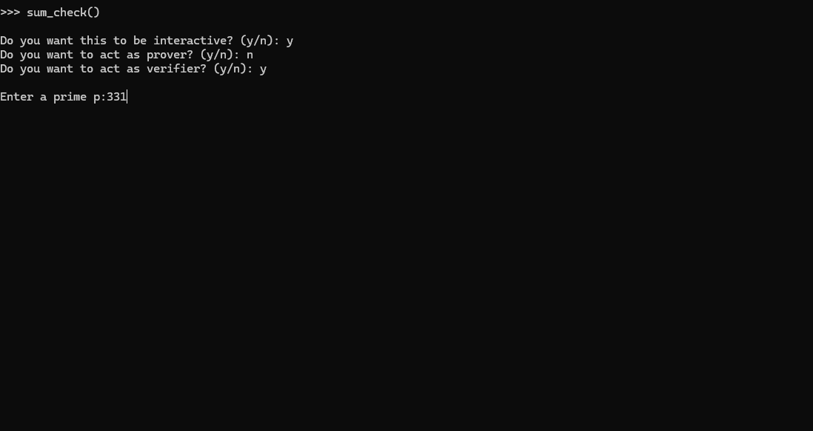
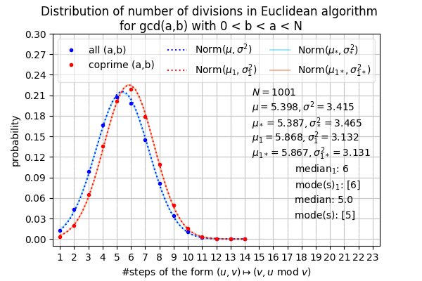
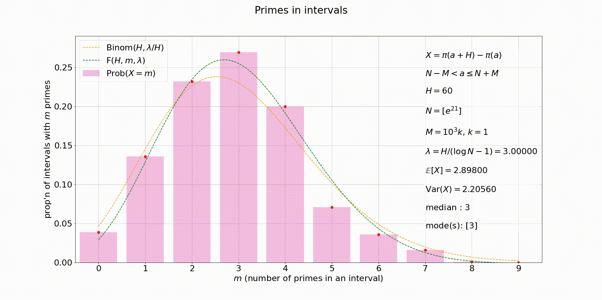

# Tristan Freiberg

**Mathematician and technical communicator working across software correctness, system validation, scientific computing, and technical documentation.**

[LinkedIn](https://www.linkedin.com/in/tmfreiberg/) · [Publications](https://mathscinet.ams.org/mathscinet/MRAuthorID/895400) · [Preprints](https://arxiv.org/search/math?searchtype=author&query=Freiberg,+T) · [Mathematics Genealogy Project](https://www.genealogy.math.ndsu.nodak.edu/id.php?id=160180)

My background spans mathematical research, scientific review, university teaching, applied cryptography, and technical writing, grounded in doctoral training in mathematics.

I am increasingly interested in documentation not only as a collection of individual documents but as a system for organizing technical knowledge: how large bodies of material are structured, maintained, versioned, reviewed, and made usable by readers with different needs and levels of expertise. That includes distinguishing tutorials, how-to guides, reference material, and explanation, establishing consistent standards, preserving institutional knowledge, and designing documentation so that it remains useful as a project or organization grows.

This interest grows naturally from a long-standing habit of careful record-keeping. I tend to preserve decisions, assumptions, intermediate reasoning, and operational knowledge rather than leaving them implicit or dependent on memory. In professional settings, that instinct has led me toward single-source documents, reproducible technical materials, engineering manuals, review standards, durable handover records, and documentation that connects technical specialists with less specialized readers.

My projects often begin with an abstract mathematical or analytical question, but they rarely end with a bare computation. I tend to build **inspectable systems** around the underlying idea: executable examples, interactive interfaces, visualizations, persistent data, and documentation intended for readers other than myself.

The projects below range from interactive-proof protocols and computational number theory to quantitative finance, medical imaging, and road-safety data.

## Selected projects

### [Sum-check and GKR](https://tmfreiberg.github.io/sumcheck-gkr-notes/)

**Making advanced interactive-proof protocols executable and teachable.**

How can someone verify that a large computation was performed correctly without repeating the entire computation? The sum-check protocol and the Goldwasser–Kalai–Rothblum (GKR) protocol, which builds on it, are foundational tools for addressing that problem.

  
   
  <em>An interactive prover–verifier exchange making the mechanics of the sum-check protocol visible.</em>

This project turns their mathematics into a **[fully rendered, interactive book](https://tmfreiberg.github.io/sumcheck-gkr-notes)** and concrete prover–verifier exchanges. It covers finite-field arithmetic, multilinear extensions, arithmetic circuits, soundness, and the layer-by-layer structure of GKR, with circuit visualizations and role-based transcripts that expose the mechanism of each protocol rather than treating it as a black box. Every theorem is numbered and cross-linked, every worked example runs live, and the reader can play the prover, the verifier, or neither and watch each round unfold — including a dishonest prover being caught, or, over a small enough field, occasionally slipping through.

The source is organized as a modern Python package with a companion command-line interface, published to the web from Markdown sources through an automated build. Following Justin Thaler's *Proofs, Arguments, and Zero-Knowledge*, the treatment supplements his presentation with additional background, complete proofs of the underlying lemmas, and executable examples. Both the sum-check and GKR protocols are covered in full, including a proof of the GKR soundness-error bound checked against a Monte Carlo simulation over a deliberately small field.

**Focus:** verifiable computation, mathematical exposition, MyST / executable documents, Python packaging, CLI design, Graphviz, pedagogical software design

---

### [Euclid's Algorithm Analysis](https://tmfreiberg.github.io/euclids_algorithm_analysis/)

**An ancient algorithm that still holds mathematical mysteries.**

Euclid's algorithm is one of the oldest algorithms still in regular use, underlying modern work in number theory, computer algebra, and cryptography. Its basic operation is elementary, but the statistical behavior of its running time remains surprisingly subtle.

  
     
  <em>The distribution of Euclid's algorithm step counts approaching its predicted normal limit as the input range grows.</em>

This project applies the algorithm to nearly **five billion pairs of integers**, records how many division steps each calculation requires, and compares the resulting distributions with theoretical asymptotic predictions. An animation makes the emerging normal distribution visible as the range of inputs grows.

The investigation also sheds numerical light on a secondary constant in the known variance formula, one for which, to my knowledge, no previous numerical estimate or closed-form expression exists. The full treatment reads as an expository mathematical article, integrating historical context, derivations, algorithms, plots, animations, and reproducible numerical evidence, with the headline estimate re-derivable from the shipped data in a single step.

The source is organized as a modern Python package with a companion command-line interface and a test suite, and the article is published to the web as a fully rendered book built automatically from executable sources. The fast computations run live at build time against the package itself, so the exposition and the numbers stay in step with the code.

**Focus:** algorithm analysis, computational statistics, large-scale computation, numerical estimation, NumPy / SciPy, Quarto / executable documents, Python packaging, CLI design, mathematical visualization, long-form technical exposition

---

### [Primes in Intervals](https://tmfreiberg.github.io/primes_in_intervals/)

**Testing a refinement of the standard probabilistic model for prime numbers.**

Prime numbers appear irregular, but their irregularity has structure. This project asks a concrete statistical question: how often does a short interval contain exactly zero, one, two, or more primes, and how closely does theory predict the answer?

  
   
  <em>Empirical prime-count distributions evolving across larger numerical ranges.</em>

The code supports several different ways of sampling intervals, including disjoint intervals, overlapping sliding intervals, and intervals beginning at primes. A custom postponed sieve generates primes without allocating a large fixed array, while sliding-window updates avoid repeating expensive calculations, so counting every overlapping interval costs about twice a disjoint count rather than a hundred times as much. Results are stored in SQLite so computations that run for hours are paid for once and can be extended across sessions.

Near a large number $N$, primes thin out to an average spacing of $\log N$. Cramér's model treats them as scattered at random with that density, which predicts that the number of primes in an interval of comparable length follows a Poisson distribution. Gallagher showed the prediction follows from the Hardy-Littlewood prime tuples conjecture, but as an asymptotic main term only, with nothing said about the error. [My published work](https://doi.org/10.1007/978-3-319-92777-0_2) conjectures a secondary term, conditional on the prime tuples conjecture and on uniformity assumptions in an estimate of Montgomery and Soundararajan that have not been established. This project measures the counts at scale and tests the prediction against them, with plots, tables, and animations showing how the fit changes as the interval length and the numerical range vary.

The repository is about 4,800 lines of Python across eleven modules, with a 163-test suite, a command-line interface exposing every function to the shell, and continuous integration. The exposition is a ten-chapter book that executes the package as it renders, so every number, table, and figure on the site is produced by the code rather than pasted in. Among its demonstrations, one line of code reproduces, in about one second, a historical prime-counting table associated with Gauss.

**Focus:** analytic number theory, reusable algorithm design, custom prime generation, statistical model comparison, SQLite, Python packaging, testing and CI, technical documentation

---

### [Black–Scholes Option Pricer](https://github.com/tmfreiberg/black-scholes-option-pricer)

**Turning a mathematical pricing formula into an interactive analytical tool.**

Rather than stopping at the closed-form Black–Scholes formula, this project builds an interactive Streamlit dashboard for exploring how a European option’s value changes with market assumptions.

The application offers three connected views:

* a heatmap showing the effect of spot price and volatility on the option premium;
* an implied-volatility tool that solves the inverse pricing problem numerically;
* premium curves showing how option value changes with spot price and time to maturity.

Parameters remain synchronized across the application, and users can save and reload calculated surfaces through a relational SQLite database. The project was an early exploration of quantitative finance and established a pattern that recurs in my later work: take a mathematical model, make its behavior visible, and give the reader a way to interact with it.

**Focus:** quantitative finance, numerical root-finding, Streamlit, NumPy, SciPy, pandas, matplotlib, SQLite

---

### [Human Against Machine: Skin Lesion Classification](https://tmfreiberg.github.io/human-against-machine/)

**A configurable deep-learning pipeline for classifying dermatoscopic images, with a browser demo that runs the model client-side.**

This began as a team project at the Erdős Institute's Spring 2024 Deep Learning Boot Camp and has since been rebuilt from scratch as an installable Python package. It uses the HAM10000 dataset to investigate binary and multiclass skin-lesion classification with fine-tuned ResNet-18 models.

The interesting problems were not in training the network. The dataset is strongly imbalanced, photographs many lesions more than once, and carries acquisition artifacts a model can learn as shortcuts. Splitting therefore happens at the lesion level so that near-duplicate images cannot straddle the train/validation boundary, and the guarantee is asserted in tests rather than assumed. Experiments are defined in YAML and identified by a hash of the configuration, so a run directory names exactly one set of settings and records them alongside its artifacts.

Evaluation reports balanced accuracy against its chance level, per-class recall with support, confusion matrices, and two competing decision rules for melanoma, rather than leaning on raw accuracy. The seven-class model reaches 0.69 balanced accuracy where guessing scores 0.14, and the write-up leads with what that means clinically: it misses about two melanomas in five.

The accompanying book explains every design decision and its limitations, and the challenge page lets you attempt the same task against the model, with a quantised ONNX network running entirely in your browser.

This is an educational machine-learning project, not a clinical diagnostic system.

**Focus:** PyTorch, ONNX, transfer learning, computer vision, leakage prevention, class imbalance, experimental design, model evaluation, testing, CI/CD, Quarto

---

### [Towards Vision Zero](https://tmfreiberg.github.io/towards-vision-zero/)

**A road-safety project whose most important result was establishing what its data could not support.**

This project analyzes 1.7 million Quebec traffic collision records from 2011 through 2022. The codebase includes multi-year data ingestion, a bilingual machine-readable data dictionary, feature engineering, XGBoost and four other estimator families under identical conditions, per-class evaluation with Matthews correlation, information-theoretic bounds on achievable performance, permutation tests, an interactive explorer over the full dataset, and a Quarto book that regenerates every figure from source.

The original goal was to predict whether a collision would result in property damage, minor injury, or serious injury or death. The model reaches a Matthews correlation of 0.44 on held-out records, which in most settings would indicate something that worked. On the same records it predicted a serious collision seven times out of forty-one thousand, and was right once.

Rather than report the first number and omit the second, I set out to establish whether any model could do better. Four independent arguments say no: collisions recorded identically on all eighteen variables frequently turn out differently; the information the features carry puts a floor under the error rate; five estimator families land in the same place; and a learning curve that flattens says more records of the same kind would not help. The variables a city actually controls — road configuration, surface, lighting, posted speed — add almost nothing once you know who was involved.

I therefore reframed the project around a question the data can answer. The interactive explorer finds historical collisions matching a user's selected conditions and shows the distribution of outcomes among those comparable records. No model, no threshold, no prediction: it counts.

That pivot is the most important feature of the project. There is a difference between reporting that a model is not good enough and establishing that no model could be, and the second is checkable. Knowing which one you face is worth more than another round of tuning.

**Focus:** public-data engineering, XGBoost, model evaluation, information theory, Bayes-error estimation, permutation testing, held-out discipline, bilingual documentation, Quarto, analytical judgment

## Research publications

Before moving into applied technical work, I spent eight years as a research mathematician in analytic and probabilistic number theory. I published **12 peer-reviewed journal papers and two expository articles**, working both independently and with collaborators across several institutions.

The research falls into three broad strands:

* **Prime distributions and rare events:** gaps between consecutive primes, primes in short intervals, and probabilistic models for arithmetic data. This includes joint work with William Banks and James Maynard published in the *Proceedings of the London Mathematical Society*.
* **Arithmetic statistics and cryptographic mathematics:** the group structure of elliptic curves over finite fields, perfect-power values, square totients, and Carmichael numbers. I coauthored *A Note on Square Totients*, published in the *International Journal of Number Theory*, with Carl Pomerance; I was fortunate to learn from the collaboration, which also gives me an Erdős number of 2.
* **Number theory and mathematical physics:** Poisson statistics for sums of two squares and their application to spectral spacings in a model from quantum chaos.

Joint work with William Banks and James Maynard on normalized prime gaps, and its extension by Jori Merikoski, was discussed by K. Soundararajan in his presentation of Maynard's research at the 2022 Fields Medal ceremony. Soundararajan used the extended result to explain the striking consequence that at least one of $e$, $\pi$, or $\pi-e$ must be a limit point of normalized consecutive prime gaps. [Watch the relevant excerpt](https://youtu.be/EXRBpsU-khk?si=8QWDlvmQQe6gi2Gt&t=4902).

These papers are evidence not only of mathematical research but of sustained technical writing: constructing and revising long rigorous arguments, collaborating with coauthors, responding to specialist peer review, and presenting difficult results for publication.

[Read the papers and preprints on arXiv](https://arxiv.org/search/math?searchtype=author&query=Freiberg,+T)

## The common thread

Across these projects, I repeatedly return to the same questions:

* How can an abstract technical idea be made inspectable?
* What does a computation or model actually establish?
* Which assumptions and limitations must be visible to the reader?
* How can code, documentation, and visualization work together as one explanatory system?
* How can technical knowledge be organized so that it remains usable, maintainable, and understandable as a project grows?

That combination of **technical depth, critical evaluation, and reader-oriented documentation** is the center of my work.

I am increasingly interested in extending that approach from individual projects to documentation practice more broadly: building systems that distinguish tutorials, how-to guides, reference material, and explanation; support review and consistent standards; preserve institutional knowledge; and help readers with different levels of expertise find what they need.
